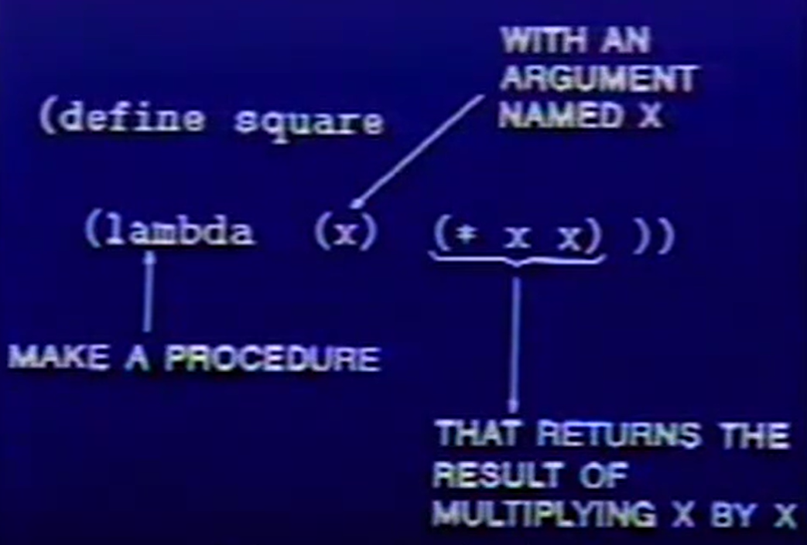
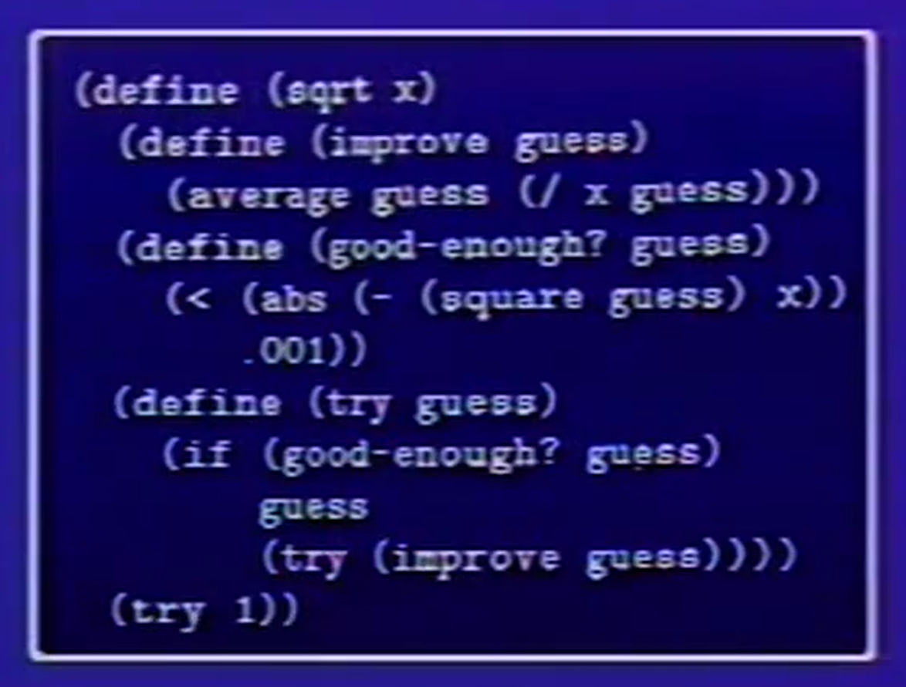

# SCIP course notes
--------

This plan gonna begin in 4.9 and each day for a part

## Lec1a: Lisp概览 Time 2022 4.9


### Part1 technique for controlling complexity
- black-box abstraction
- Conventional interfaces
- Metaliguistic abstraction -- making new languages

### Part2 General framework
- primitive elements
- means of combination
- measn of abstraction

``` Lisp
 (+ 3 17.4 5)   = 25.5
```


**syntactic sugar** 


``` Lisp

//**RECURSIVE DEFINITION** 
// x for the orginal number while guess for the guess number
// so in this example 'guess' and 'x' are all primitive elements
// while "try" | "good-enough" | "average" and so on are means of combination

(DEFINE (TRY GUESS X)  
    (IF (GOOD-ENOUGH? GUESS X)  
        GUESS  
        (TRY (IMPROVE GUESS X) X)))
        
(define (improve guess x)  
    (average guess (/ x guess)))
    
// process (good-enough? guess x) return false or true

(define (good-enough? guess x)  
    (< (abs (- (square guess) x)) .001))
    
```


- block structure

Q: what's the difference between the clause  
    (define A (* 5 5)) AND (define (D) (* 5 5))  
A: In the Lisp command, input  
    A -> 25 while the second  
    D -> compound procedure D  
    (D) -> 25 //running procedure D  
    (A) -> error  
      
    for A is the primitive element while D is a procedure  
    
    
## Lec1b: 计算过程 Time 2022 4.10

### part1

kinds of expressions
- numbers
- symbols
- special rules
    - Lambda expressions
    - definitions
    - conditions
    - combinations

**the difference between interation and recursion** 

```
example: add x and y  
        1st definition method -> (define (+ x y)  
                                    (if (= x 0)  
                                        y  
                                        (+ (-1+ x) (1+ y))))  
        2nd definition method -> (define (+ x y)  
                                    (if (= x 0)  
                                        y  
                                        (1+ (+ (-1+ x) y))))  
                    
```
different shape as follows:
```Lisp
(+ 3 4)
 1st def_med -> (+ 3 4)  
                (+ 2 5)
                (+ 1 6)
                (+ 0 7)
                -> 7
 2nd def_med -> (+ 3 4)
                (1+ (+ 2 4))
                (1+ (1+ (+ 1 4)))
                (1+ (1+ (1+ (+ 0 4))))
                (1+ (1+ (1+ 4)))
                (1+ (1+ 5))
                (1+ 6)
                -> 7

it's easy to recognize that 1st med is an iteration approach and 2nd med is a recursion approach.
```


Notes:
interation only changes the arguments each part \n
    while recursion not only changes the arguments but also changes the shape each part returns


